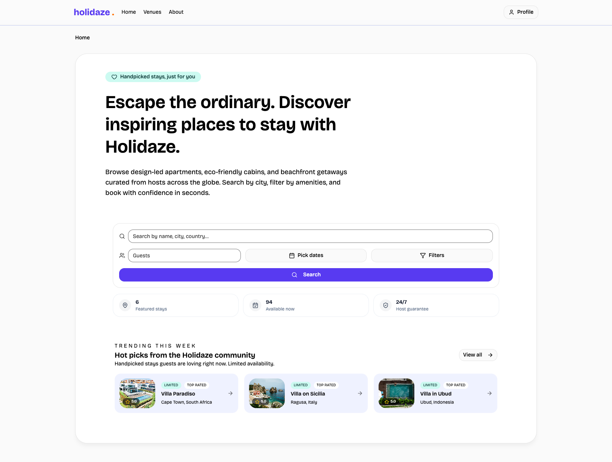

## Project Exam 2

[](https://github.com/johnsulf/project-exam-2/actions/workflows/ci.yml)
[](https://github.com/johnsulf/project-exam-2/actions/workflows/pages.yml)

Holidaze web app – browse venues, manage listings, and handle bookings with an improved search experience, inline availability filtering, and post-stay owner ratings.

## Preview image



Built with:

- React 19 + TypeScript
- Vite 5 (fast dev & bundling)
- Tailwind CSS v4 + shadcn/ui component primitives
- TanStack Query for data fetching & cache
- Zustand for client auth/session state

The project is production-leaning: strongly typed, componentised, and ready for CI/CD. Clone, install, and run in under five minutes.

---

## Quick Start

Prerequisites:

- Node 20+ (LTS recommended)
- pnpm (install globally: `npm i -g pnpm` if needed)

Clone & run:

```bash
git clone <repo-url>
cd project-exam-2
pnpm install
pnpm dev
```

Then open the printed local URL (usually http://localhost:5173).

---

## Scripts

| Script           | Purpose                                 |
| ---------------- | --------------------------------------- |
| `pnpm dev`       | Start Vite dev server with HMR          |
| `pnpm build`     | Type check then build production bundle |
| `pnpm test`      | Run Vitest test suite (CI friendly)     |
| `pnpm test:unit` | Interactive test watcher/UI             |
| `pnpm test:e2e`  | Test with PlayWright                    |
| `pnpm lint`      | Run ESLint over source                  |
| `pnpm typecheck` | Run TypeScript without emitting         |

---

## Features

- Venue search with client-side filtering (name, description, and location fields) plus amenity/date filters
- Mobile bottom-sheet search UI, including inline popovers for dates & filters
- Venue detail gallery with smooth image transitions
- Auth flows (sign in, register customer, register manager) with subtle entry animations and spinner feedback
- Owner dashboard for creating, editing, deleting venues, and managing bookings; responsive cards on mobile
- Profile view with past/upcoming bookings, avatar editing, and owner-only rating updates
- Shared UI based on shadcn/ui + Tailwind utility classes

---

## Required Project Links

- Style Guide: [Figma](https://www.figma.com/proto/yZvqiW2RABCeLQqSNWAuhk/Holidaze---Style-Guide---Prototype?node-id=0-1&t=CzSYfnTh7sjlGqfT-1)
- Design Prototype Desktop: [Figma](https://www.figma.com/proto/yZvqiW2RABCeLQqSNWAuhk/Holidaze---Style-Guide---Prototype?node-id=57-6401&t=2xDY2KzqmgSfusDb-1)
- Design Prototype Mobile: [Figma](https://www.figma.com/proto/yZvqiW2RABCeLQqSNWAuhk/Holidaze---Style-Guide---Prototype?node-id=68-3133&t=CzSYfnTh7sjlGqfT-1)
- Gantt Chart: [GitHub Projects](https://github.com/users/johnsulf/projects/7/views/2)
- Kanban Board: [GitHub Projects](https://github.com/users/johnsulf/projects/7/views/1)
- Repository: [GitHub](https://github.com/johnsulf/project-exam-2)
- Live Demo: [Holidaze](https://johnsulf.github.io/project-exam-2/)

Keep these updated for examiner & collaborators.

---

## Project Structure (Evolving)

```
src/
  components/        # Reusable UI (incl. auth forms, layout)
  features/          # Domain features (venues, bookings, profile, manager)
  lib/               # API helpers, query keys, utilities
  pages/             # Route-level React components
  providers/         # Global context (auth, theme, router)
  config/            # Runtime configuration
  index.css          # Tailwind layers + motion utilities
```

---
